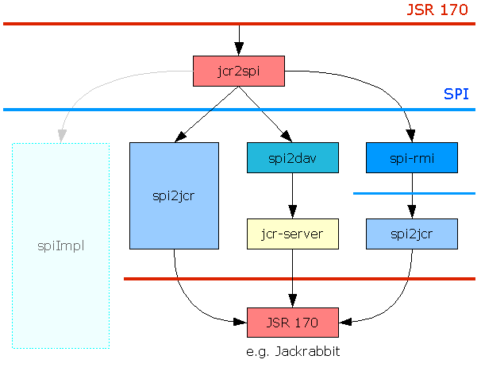

<!--
   Licensed to the Apache Software Foundation (ASF) under one or more
   contributor license agreements.  See the NOTICE file distributed with
   this work for additional information regarding copyright ownership.
   The ASF licenses this file to You under the Apache License, Version 2.0
   (the "License"); you may not use this file except in compliance with
   the License.  You may obtain a copy of the License at

       http://www.apache.org/licenses/LICENSE-2.0

   Unless required by applicable law or agreed to in writing, software
   distributed under the License is distributed on an "AS IS" BASIS,
   WITHOUT WARRANTIES OR CONDITIONS OF ANY KIND, either express or implied.
   See the License for the specific language governing permissions and
   limitations under the License.
-->

Jackrabbit SPI
==============
This is the SPI component of the Apache Jackrabbit project. The SPI enables
a separation between transient and persistent components of the JCR
repository. The transient component ("repository client") is implemented on
top of the persistent component ("repository server") as a consumer of the
SPI and, in turn, exposes the JCR API to the application. The SPI is not
intended to be used by the application directly.

Primary Goals
-------------
The Primary goals of the SPI approach are to define support for
client-server architecture and to ease the implementation of the JCR API.

### Client-Server architecture
The SPI provides a natural division between the client and server
components of a remote JCR repository. The SPI is designed with this usage
in mind, enabling an implementation to minimize network traffic. The SPI
lends itself to protocol mappings to protocols like WebDAV, SOAP or others
in a straightforward yet meaningful way.

### Implementation Support
Introducing the SPI can simplify the implementation of JCR on top of an
existing repository by reducing the task to one of implementing the SPI.
Such an implementation might then rely on a generic transient layer (such
as e.g. [Jackrabbit JCR to SPI](jackrabbit-jcr-to-spi.html) to provide the JCR API.

Architecture and Design Overview
--------------------------------
The specific functions exposed by the SPI are:

* Reading from and writing to the persistent storage.
* Authentication
* Access control
* Locking
* Query
* Versioning
* Direct to workspace XML import
* Storage of the central namespace registry
* Node type management, enforcement of constraints as well as definition storage.

Therefore SPI designs a set of interfaces and methods needed to expose the
functionality of the persistent layer of a compliant JCR repository. The
main interfaces of the SPI are _RepositoryService_ and _Batch_.

The _RepositoryService_ interface defines the methods used to retrieve
information from the persistent layer. In addition it contains the methods
that affect the persistent state of the repository.

The _Batch_ is an interface to an ordered list of primitive operations
against the persistent layer. The _Batch_ is then submitted to the
_RepositoryService_ to make the specified sequence of changes.

In addition the SPI defines interfaces for internal representations of JCR
name, JCR nath and Item identifiers. The SPI itself only uses names and
paths in their fully qualified.

Existing Implementations
------------------------
The Jackrabbit project currently provides a single SPI implementation:

* [Jackrabbit SPI to JCR](jackrabbit-spi-to-jcr.html):  
    An implementation of the SPI interfaces wrapping an implementation of the
    JCR API such as e.g. Jackrabbit Core.

Other SPI implementations can be found in the _sandbox_ folder of the Jackrabbit project.

* **SPI to WebDAV**:  
    SPI implementation on top of WebDAV connecting to a 
    [Jackrabbit JCR Server](jackrabbit-jcr-server.html).
    
* **SPI-RMI**:  
    A RMI layer.used to remote any SPI implementation. While 
    [Jackrabbit SPI to JCR](jackrabbit-spi-to-jcr.html)
    and _SPI to WebDAV_ really are repository implementations, the _SPI-RMI_
    is rather a 'repeater' for SPI calls using RMI.
    _Note_: RMI access is deprecated and will be removed in version 2.22.x
    (see [JCR-4792](https://issues.apache.org/jira/browse/JCR-4972) for details).
    
* **SPI Logger**:  
    Utility implementation to log SPI usage.

See the image below for a overview over existing and planned SPI
implementations.

