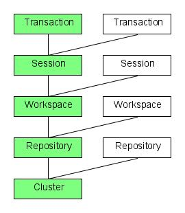
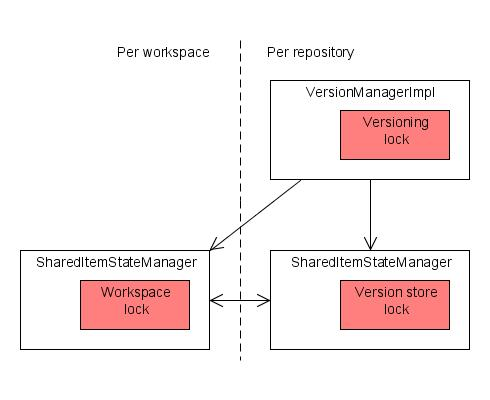
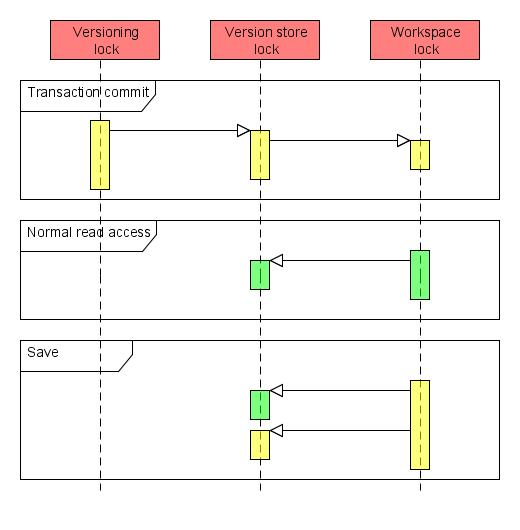

<!--
   Licensed to the Apache Software Foundation (ASF) under one or more
   contributor license agreements.  See the NOTICE file distributed with
   this work for additional information regarding copyright ownership.
   The ASF licenses this file to You under the Apache License, Version 2.0
   (the "License"); you may not use this file except in compliance with
   the License.  You may obtain a copy of the License at

       http://www.apache.org/licenses/LICENSE-2.0

   Unless required by applicable law or agreed to in writing, software
   distributed under the License is distributed on an "AS IS" BASIS,
   WITHOUT WARRANTIES OR CONDITIONS OF ANY KIND, either express or implied.
   See the License for the specific language governing permissions and
   limitations under the License.
-->

Concurrency control
===================
The internal concurrency model in Apache Jackrabbit is fairly complex and a
number of deadlock issues have been reported and fixed over the Jackrabbit
1.x release cycle. This document is the result of a design and code review
targeted at proactively preventing other similar issues.

This document is about the internal concurrency and synchronization model
in Jackrabbit, _not_ about the JCR locking feature. Note that the review
that led to this document targeted concurrency control at an architectural
level and did not focus much on issues like thread-safety of individual
classes or components.

This review is based on Jackrabbit version 1.5 in default configuration.

Architectural background
------------------------

In terms of concurrency control, the Jackrabbit
architecture can roughly be divided to five main layers:

1. Cluster
2. Repository
3. Workspace
4. Session
5. Transaction

The clustering layer takes care of synchronizing changes across one or more
cluster nodes that are each treated as individual repositories that happen
to share their content. Concurrency control across different cluster nodes
is achieved using a single write lock that a cluster node is required to
acquire before it can commit any changes to the shared state. On the other
hand all cluster nodes can read the shared content in parallel with no
explicit synchronization. Note that since the cluster nodes only share a
single lock, a deadlock can not occur between the locks in one node and the
ones in another. A single deadlocked node can still potentially block
writes to the entire cluster, but the clustering feature can not add any
new deadlock scenarios if each node would be deadlock-free by itself.

The repository layer takes care of all global repository state like the
node type registry and the version storage. Instead of a single global
repository lock, all the repository-wide components have their own
synchronization mechanisms. The most notable component from a concurrency
control point of view is the version storage, that actually contains two
locking mechanisms; one in VersionManagerImpl for high level versioning
operations and one in the underlying SharedItemStateManager for controlling
access to the underlying persistence mechanism.

A repository consists of one or more workspaces that contain the normal
content trees of the repository. Each workspace consists of a few
components like the persistence mechanism and the search index. The
persistence mechanism is built from a SharedItemStateManager that controls
all item operations and a PersistenceManager that persists items in
permanent storage. Most persistence managers use Java synchronization or
some other locking mechanism for concurrency control, but since they
typically don't interact much with other parts of the repository they are
not that critical from a global concurrency perspective. On the other hand,
the SharedItemStateManager that uses a read-write lock is a key element
especially given the way it interacts with the repository-wide version
store. Note that since Jackrabbit 1.4 it has been possible to configure
locking strategy of the SharedItemStateManager to use a more fine-grained
set of locks to allow concurrent write access to different parts of the
content tree. This review focuses on the default case of having just a
single SharedItemStateManager lock, but from a locking perspective the more
fine-grained case is roughly equivalent to having more workspaces and thus
the results of this review should still apply.

Each workspace can be accessed by zero or more JCR sessions. Each session
contains a transient space that keeps track of all unsaved changes in that
session. Since the transient space is local to a session and since a
session should only be accessed by one thread at a time, there are few
concurrency concerns associated with the use of sessions. However, note
that the thread-safety requirements of sessions are in many cases not
explicitly enforced by Jackrabbit, so a client that intentionally or
accidentally uses a single session from multiple concurrent threads may
well end up corrupting the internal state of the session.

Transactions are handled in Jackrabbit by wrapping all item operations
(saved transient changes and direct workspace updates, as well as
versioning and locking operations) into a sort of a larger transient space
that gets persisted only when the transaction is committed. There is no
"transaction lock" in Jackrabbit, but transaction support still
fundamentally changes Jackrabbit concurrency control as it basically
replaces all write operations (and related locking) with the larger commit
operation. This transaction mode is only activated when a session is within
the context of an XA transaction.

Main synchronization mechanisms
-------------------------------

The main synchronization mechanisms in Jackrabbit
are the read-write locks in the SharedItemStateManager and
VersionManagerImpl classes. Other components also have concurrency control
features, for example the LockManagerImpl class (used for handling JCR
locks) uses a reentrant lock and the NodeTypeRegistry class relies on Java
synchronization. This review focuses on just the two main components as
those are by far the most actively used and the ones that could potentially
block all access to repository content in case of a deadlock. The three
main locks to be concerned about are:

* "Workspace lock", the read-write lock of the per-workspace SharedItemStateManager
* "Versioning lock", the read-write lock of the repository-wide VersionManagerImpl
* "Version store lock", the read-write lock of the SharedItemStateManager associated with the version manager

Each of these locks can be locked exclusively for write access or
inclusively for read access. In other words, any number of concurrent
readers can keep the lock, but any single writer will block out all other
readers and writers.

As noted in the section above, the workspace locks may also be collections
of more finely grained locks, but this review concentrates on the default
case. Note also that each workspace has it's own lock, so even if one
workspace is exclusively locked, other workspaces can still be accessed.

Conditions for deadlocks
------------------------
A deadlock can only occur if the holder of one lock tries to acquire
another lock and there is another thread (or a series of other threads)
that tries to do the reverse. This situation can only arise if a) locks are
acquired in a nested sequence, b) different threads can acquire the nested
locks in a different order, and c) at least two exclusive locks are being
acquired.

Most operations in Jackrabbit avoid deadlocks in one of the following three
ways:

* Only a single lock is held at a time, breaking condition a. This case
    covers most of the code doing sanity checks and other preparing work
    associated with many operations.
* In case of nested locks, the code guarded by the inner lock never
    tries to acquire another lock, breaking condition b. This case covers for
    example the numerous calls to the underlying persistence managers that
    typically have their own synchronization mechanism but never call out to
    other Jackrabbit components except perhaps the namespace registry that also
    satisfies this condition.
* None of the nested locks are exclusive. This covers all read
    operations in Jackrabbit, so a deadlock can never occur if all clients only
    read from the repository.

The potentially troublesome cases are two or more concurrent write
operations with nested locks, or a write operation with two nested
exclusive locks running concurrently with read operations with nested
locks. See below for the results of the code review that tried to identify
and clear such cases. The acquired write locks are marked in bold to make
it easy to spot potential problems.

Code review
-----------
This section contains the results of a code review whose purpose was to
identify the order and nesting of the locks acquired by many common
operations in Jackrabbit. The results of the review were compared to the
above conditions for deadlock.

Note that the descriptions of the write operations below assume
non-transactional context. See the last subsection for the behaviour in
transactional environments.

### Normal read access
Read access to the workspace typically only requires a read lock on the
SharedItemStateManager of that workspace, but since the version store is
mapped to the virtual `/jcr:system/jcr:versionStorage` inside the repository,
there are cases where also the read lock of the version store needs to be
acquired.

1. Workspace read lock, for reading normal node content
    1. Version store read lock, for reading version content

This nested lock is potentially unsafe in a transactional context, see the
subsection on transaction commit below for more details.

### Versioning read access
Some version accesses are handled directly through the version manager
instead of looking through the `/jcr:system/jcr:versionStorage` tree. Such
accessed are guarded with the VersionManagerImpl read lock.

1. Versioning read lock, for accessing version information
    1. Version store read lock, for reading version information

The nested lock here is safe as the version store lock never covers code
that tries to acquire the versioning lock.

### Transient changes
All transient changes like those created by `Node.addNode()` or
`Session.move()` are stored in the session-local transient space without
needing any synchronization except for the read locks used for accessing
the underlying workspace state. A write lock is only needed when the
accumulated changes are being persisted using the `save()` call described
below.

### Save
The ItemImpl.save() method (that SessionImpl.save() also calls) collects
all current transient changes to a single change log that is then persisted
as an atomic update. Any new versionable nodes will cause empty version
histories to be created in the version store. Note that ItemImpl.save() is
synchronized on the current session, enforcing the rule that no two threads
should be concurrently using the same session.

1. Workspace read lock, for sanity checks and other preliminary work
    1. Multiple non-overlapping instances of (only when creating new version histories)
    2. Workspace read lock, for checking the current state of the nodes being modified
    3. Version store read lock, for checking whether a version history already exists
    4. Versioning *write lock*, for creating a new version history
        1. Version store *write lock*, for persisting the version history
2. Workspace *write lock*, for persisting the changes 
    1. Version store read lock, for checking references
    2. Version store *write lock*, for persisting updated back-references

Many of the other write operations below call `ItemImpl.save()` internally to
persist changes in the current workspace. However, in the descriptions I've
only included the last "Workspace write lock" branch (with the "Version
store write lock" excluded if it's clear that no back-references need to be
updated) as the operations are guaranteed to never contain cases where new
version histories would need to be created.

Here we have three cases of nested locks involving one or more exclusive
locks:

* Versioning write lock -> Version store write lock
* Workspace write lock -> Version store read lock
* Workspace write lock -> Version store write lock

All these nested locks are safe in non-transactional context since the
version store lock never covers code that tries to acquire one of the other
locks. The same is true for the first case also in transactional context,
but see the transaction commit subsection below for a discussion of how the
other two cases are different with transactions.

### Merge and update
The `Node.merge()` and `Node.update()` methods both call
`NodeImpl.internalMerge()` that acquires a new session on the source
workspace and copies relevant content to the current workspace.

1. Multiple non-overlapping instances of
    1. Source workspace read lock, for copying content to the current workspace
    2. Current workspace read lock, for comparing current status with the one being merged
1. Current workspace *write lock*, for persisting the changes
    1. Version store read lock, for checking references
    2. Version store *write lock*, for persisting updated back-references

The nested locks above are discussed in the section on the save operation.

### Copy, clone and move
The various `copy()`, `clone()` and `move()` methods in WorkspaceImpl use the
similarly called methods in BatchedItemOperations to perform batch
operations within a single workspace or across two workspaces. From a
synchronization perspective these operations are much like the merge and
update operations above, the difference is mostly that the source workspace
may be the same as the current workspace.

1. Multiple non-overlapping instances of
    1. Source workspace read lock, for copying content to the current workspace
    2. Current workspace read lock, for comparing current status with the one being copied
1. Current workspace *write lock*, for persisting the changes
    1. Version store read lock, for checking references
    2. Version store *write lock*, for persisting updated back-references

The nested locks above are discussed in the section on the save operation.

### Checkin
The `NodeImpl.checkin()` method first creates a new version of the node in
the shared version store and then updates the appropriate mix:versionable
properties of the node.

1. Workspace read lock, for sanity checks and other preliminary work
2. Versioning *write lock*, for creating the new version in the version store
    1. Workspace read lock, for copying content to the new version
    2. Version store *write lock*, for persisting the new version
3. Versioning read lock, for accessing the newly created version
    1. Version store read lock, for reading the new version
4. Workspace *write lock*, for updating the node with references to the new version
    1. Version store read lock, for checking references
    2. Version store *write lock*, for persisting updated back-references

The overlapping lock region above is not troublesome as there are no cases
where a versioning lock is acquired within the scope of a workspace lock.
Note that there previously were such cases, but this code review shows that
all of them have since been solved.

The nested locks above are discussed in the sections on versioning read
access and the save operation.

### Checkout
The `NodeImpl.checkout()` method simply does some sanity checks and updates
the versioning metadata of the node to reflect the changed state. No access
to the shared version store is needed.

1. Workspace read lock, for sanity checks
2. Workspace *write lock*, for updating the node to reflect the checked out state
    1. Version store read lock, for checking references

The nested lock above is discussed in the section on the save operation.

### Restore
The various `Node.restore()` and `Workspace.restore()` methods all end up
calling `NodeImpl.internalRestore()` that copies contents of the selected
version back to the workspace. Finally the changes are persisted with a
`ItemImpl.save()` call.

1. Multiple non-overlapping instances of:
    1. Versioning read lock, for copying content back to the workspace
    2. Workspace read lock, for comparing the current state with the version being restored
2. Workspace *write lock*, for persisting the changes
    1. Version store read lock, for checking references
    2. Version store *write lock*, for persisting updated back-references

The nested locks above are discussed in the section on the save operation.

### Transaction commit

As discussed in the architecture section above,
a transaction context overrides all the other write operations in favor of
the two-phase commit driven by the transaction manager. The Jackrabbit part
of a potentially distributed transaction is coordinated by the
XASessionImpl class that causes the following locking behavior:

1. Versioning *write lock*, for the entire commit
    1. Version store *write lock*, for persisting modified version histories
        1. Workspace *write lock*, for persisting modified content

The curious ordering of the locks is caused by the way the prepare and
commit parts of the different transaction components are nested. This
nesting of the workspace lock within the version store lock is a bit
troublesome in comparison with the nesting in read operations and
non-transactional writes where the order of the locks is reverse. The
nesting order here can not be easily changed as any new versions and
version histories need to be persisted before workspace content that refers
to them. Possible solutions could be either to disable or redesign the
reference checks done in a transactional context, or to relax transaction
semantics by persisting the version history changes already in the prepare
phase in which case the version store lock wouldn't need to cover the
workspace lock. However, even before this issue is fixed, the impact is
quite limited and can easily be worked around by typical clients.

In read operations the version store read lock is only acquired after the
workspace lock if reading content in `/jcr:system/jcr:versionStorage`.
Clients that never looks at the `/jcr:system/jcr:versionStorage` tree and
uses the JCR API methods like getVersionHistory() to access version
information will not trigger the potential deadlock case.

Write operations can only cause a deadlock when both transactional and
non-transactional writes are performed concurrently against the same
repository. A repository that is consistently accessed either
transactionally or non-transactionally will not trigger this deadlock. Note
that this restriction is workspace-specific, i.e. one workspace can safely
be written to transactionally even if another workspace is concurrently
written to non-transactionally.

Summary and future work
-----------------------
This review shows that while the internal locking behaviour in Jackrabbit
is still far from simple, there aren't any major deadlock scenarios
remaining. The two issues identified in the review can be easily avoided by
following these two rules:

* Use the JCR versioning API instead of the
    /jcr:system/jcr:versionStorage tree to access version information
* Don't mix concurrent transactional and non-transactional writes to a
    single workspace

The transaction commit subsection above outlines some possible solutions to
make even these workarounds unnecessary.

The following other potential improvements were identified during the code
review:

* Storing the version history back-references in the workspaces that
    contain the references would simplify a lot of code and remove a major
    source of interaction between the workspace and version store when updating
    content. The downside of this change is that removing versions and version
    histories would be much more difficult as all workspaces would need to be
    checked for potential references.
* The current design contains lots of cases where read locks are
    acquired and released multiple times in sequence. This is often caused by
    the need to check the transient space when reading something from the
    repository. It might be useful to extend the workspace read lock to cover
    also all the transient spaces even when the transient spaces would still be
    session-specific.
* Adopting a single global repository lock for all per-repository
    components would simplify lots of code at the expense of some performance.

