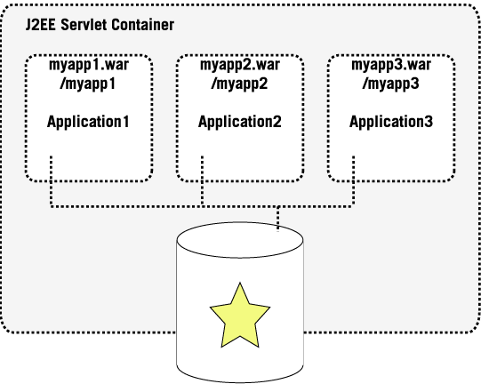
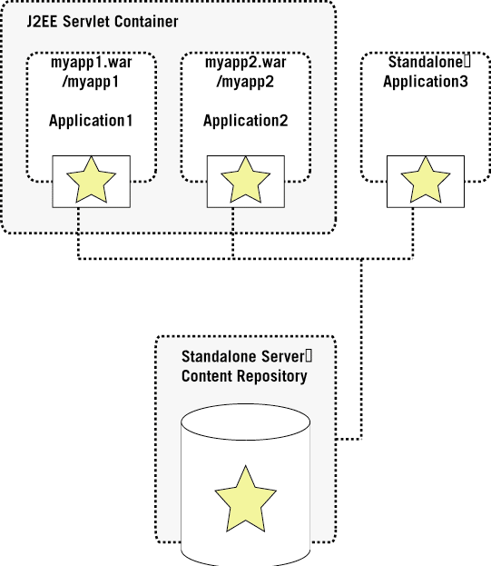

<!--
   Licensed to the Apache Software Foundation (ASF) under one or more
   contributor license agreements.  See the NOTICE file distributed with
   this work for additional information regarding copyright ownership.
   The ASF licenses this file to You under the Apache License, Version 2.0
   (the "License"); you may not use this file except in compliance with
   the License.  You may obtain a copy of the License at

       http://www.apache.org/licenses/LICENSE-2.0

   Unless required by applicable law or agreed to in writing, software
   distributed under the License is distributed on an "AS IS" BASIS,
   WITHOUT WARRANTIES OR CONDITIONS OF ANY KIND, either express or implied.
   See the License for the specific language governing permissions and
   limitations under the License.
-->

Deployment Models
=================
JSR-170 explicitly allows for numerous different deployment models, meaning
that it is entirely up to the repository implementation to suggest certain
models.

Jackrabbit is built to support a variety of different deployment models,
some of the possibilities on how to deploy Jackrabbit will be outlined
here.

See also the following HOWTO documents for setting up and using the
different deployment models:

* [JCR client application HOWTO](jcr-client-application-howto.html)
* Model 1: [Application Bundle HOWTO](application-bundle-howto.html)
* Model 2: [Shared J2EE Resource HOWTO](shared-j2ee-resource-howto.html)
* Model 3: [Repository Server HOWTO](repository-server-howto.html)

Model 1: The (Web-) Application Bundle
--------------------------------------
For many applications, usually applications that run in a closed context
without interacting with other applications or data sources, it might be
desirable to bundle a content repository with the application itself.

Jackrabbit is built for this lightweight model and allows obviously through
the abstraction provided by JSR-170 to move at any point in time to a
different deployment model in case this should be desirable for the context
that the application runs in.

This makes Jackrabbit ideal to be packaged as a lightweight out-of-the-box
content repository that allows an application vendor to make sure that
there are no dependencies to a pre-installed content repository.

The instance of Jackrabbit that is package with the application is running
in-proc inside the same JVM and cannot be accessed by any other
application.

This deployment model is particularly lightweight and does not require a
network layer.

The individual repository instances are started and stopped with their
containing applications, which means that the application is not only
connecting to the repository but is also in charge of starting and stopping
the repository.

As an example of this deployment model we assume a WebApplication packaged
into a .war file which is deployed into a WebContainer, which not only
contains the application but also the actual content repository.

Application1 and Application2 both contain their own instances of a Content
Repository distributed as a part of their .war file and therefore loaded
with the web application's class loader which makes it invisible to other
applications.

This deployment model of course also works for any stand-alone application
and not just for web applications.

Model 2: Shared J2EE Resource
-----------------------------
A second way to deploy a repository is to make it visible as a resource to
all the web applications that are running inside a Servlet Container by
registering the Repository as a Resource Adapter to the Application Server.

Similar to the first deployment model this deployment model does also not
require a network layer and therefore would be considered in-proc and is
running inside the same JVM.

The repository is started and stopped with the Application Server but is
visible to all the applications to connect to.

This setup also allows to take advantage of the XA facilities of the
Application Server and could use the application servers single sign-on
mechanisms that are provided as part of the J2EE framework.

Model 3: The Repository Server
------------------------------
In enterprise environments the client/server deployment model is widely
used for relational databases. While with relational databases this is
probably the only deployment model that is supported by most RDBMS vendors
for repositories, in particular for Jackrabbit, this is only on various
options.

The client/server deployment model will certainly be very popular in
environments that where it is desirable to physically separate the content
repository (or data) layer from the application or presentation layer, so
the content repository can be used from many different applications,
physically and can be scaled individually.

This deployment model assumes that there is a network layer between the
content repository server and the respective content repository client.

While the applications communicate through the JSR-170 API with the content
repository client. The content repository client then communicates through
any form of transport protocol with the stand-alone content repository
server.

The transport protocol between the client and the server is subject to
implementation and not mandated by JSR-170. Popular choices might include
RMI over JRMP or IIOP or WebDAV and its extensions.
