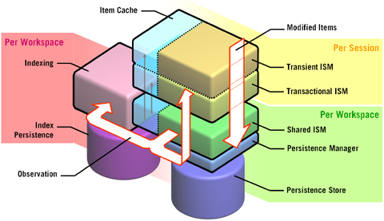

<!--
   Licensed to the Apache Software Foundation (ASF) under one or more
   contributor license agreements.  See the NOTICE file distributed with
   this work for additional information regarding copyright ownership.
   The ASF licenses this file to You under the Apache License, Version 2.0
   (the "License"); you may not use this file except in compliance with
   the License.  You may obtain a copy of the License at

       http://www.apache.org/licenses/LICENSE-2.0

   Unless required by applicable law or agreed to in writing, software
   distributed under the License is distributed on an "AS IS" BASIS,
   WITHOUT WARRANTIES OR CONDITIONS OF ANY KIND, either express or implied.
   See the License for the specific language governing permissions and
   limitations under the License.
-->

How Jackrabbit works
====================
The diagram on the left explains which components of the Jackrabbit are
used when a user of the JCR API modified content in the content repository.
This is a simple and very common operation, that touches a large portion of
the components in the Jackrabbit implementation. Please keep in mind that
this implementation architecture is not mandated by JCR, but has been
designed from scratch based on JCR.

The used components and their respective functions in the order of their
appearance in the use case of writing or modifying content in the content
repository:

* **Transient Item State Manager**  
    Once content items are read by a session
    they are cached in the Transient Item State Manager. When those items are
    modified the modification is only visible to that same session, in the
    so-called "transient" space.

* **Transactional Item State Manager** 
    When the Application persists the
    modified items using the JCR `Item.save()` or `Session.save()` the transient
    Items are promoted into the Transactional ISM. The modifications are still
    only visible within the scope of this transaction, meaning that other
    sessions will not see the modification until they are committed. The commit
    is implicit if the Content Repository is not running in an XA environment.

* **Shared Item State Manager** 
    Once a transaction is committed the Shared
    Item State Manager receives the changelog and publishes the changes to all
    the sessions logged into the same workspace. This means that all the Item
    States that are cached and referenced by other sessions are notified and
    possibly updated or invalidated. The Shared Item State Manager also
    triggers the observation and hands the changelog over to the persistence
    manager that is configured for this workspace.

* **Persistence Manager**  
    The Persistence Manager persists all the Item
    States in the changelog passed by the Shared ISM. The persistence manager
    is a very simple, fast and transactional interface that is very low-level
    and does not need to understand the complexities of the repository
    operations, but basically just needs to be able persist and retrieve a
    given item based on its item id.

* **Observation**  
    When a transaction is committed the Shared Item State
    Manager triggers the Observation mechanism. This allows applications to
    asynchronously subscribe changes in the workspace. Jackrabbit also
    non-standard offers a synchronous observation.

* **Query Manager / Index**  
    Through a synchronous observation event the Query
    Manager is instructed to index the new or modified items. A content
    repository index is much more complex than a classical RDB index since it
    deals with content repository features like the item hierarchy, nodetype
    inheritance or fulltext searches.

