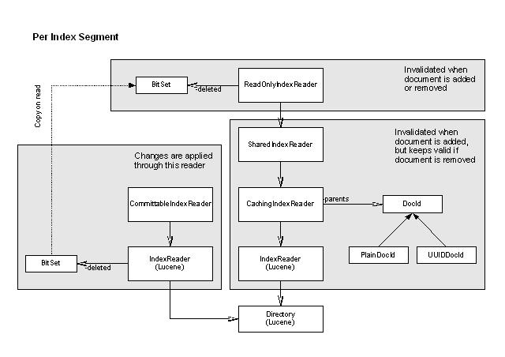
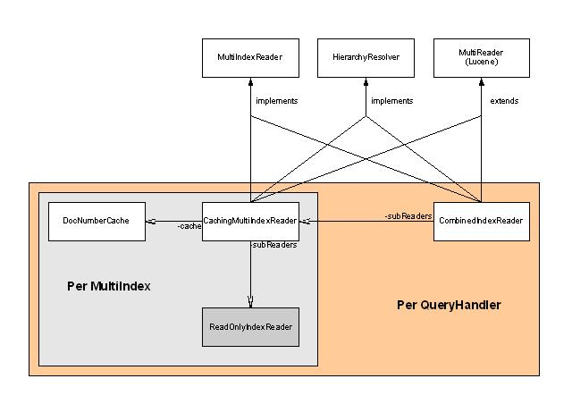

<!--
   Licensed to the Apache Software Foundation (ASF) under one or more
   contributor license agreements.  See the NOTICE file distributed with
   this work for additional information regarding copyright ownership.
   The ASF licenses this file to You under the Apache License, Version 2.0
   (the "License"); you may not use this file except in compliance with
   the License.  You may obtain a copy of the License at

       http://www.apache.org/licenses/LICENSE-2.0

   Unless required by applicable law or agreed to in writing, software
   distributed under the License is distributed on an "AS IS" BASIS,
   WITHOUT WARRANTIES OR CONDITIONS OF ANY KIND, either express or implied.
   See the License for the specific language governing permissions and
   limitations under the License.
-->

Index readers
=============
Jackrabbit uses Lucene as the underlying index implementation and provides
several extensions and customizations that help improve performance in an
environment where changes to the index are frequent. The extensions also
cover features that are not supported by Lucene, like hierarchical queries.

CachingIndexReader
------------------
The `CachingIndexReader` is at the very bottom of the index reader stack in
Jackrabbit. It's main purpose is to cache the parent relationship of a
node. Each node is represented with a document in the index and one of the
fields is `_:PARENT`. The value of this field is the string representation of
the parent nodes UUID. In case of the root node the the parent field
contains an empty string as its value. Several queries in Jackrabbit are
hierarchical and check whether a node is a descendant of another node. For
the very simple case, where one needs to know if a node is the child of
another node, we can just look up both nodes (lucene documents) in the
index and compare the parent field on one node with the `_:UUID` field of the
other. If they match the one is the child of the other node. When it comes
to evaluating a descendant axis, this becomes much more expensive and will
cause lots of document lookups in lucene. By caching the parent child
relationship of documents, hierarchical operations can be executed much
faster.

The cache consists of an array of DocId instances. The length of this array
corresponds to the number of documents accessible through the index reader.
That is every document in the index has a corresponding cache entry in the
array. Initially the cache is empty and is filled as it is accessed. There
are two kinds of DocIds: PlainDocId and UUIDDocId. When the parent of a
node resides in the same index segment a PlainDocId is created, which
simply contains the document number of the parent. If the parent resides in
a different index segment a UUIDDocId is created, which contains the UUID
of the parent node. When a UUIDDocId is resolved it is passed an index
reader, which allows it to get the document number for the UUID and cache
it for later reuse.

Overwriting DocId
-----------------
It may happen that a PlainDocId is present in the cache of a
`CachingIndexReader` but must be considered invalid in the context of a call.
`CachingIndexReader.getParent()` may be called from a ReadOnlyIndexReader
instance which has the target of the PlainDocId in the set of deleted
document. This indicates that the nodes has been deleted or modified. Thus
it has traveled to another index segment. In this case the PlainDocId is
overwritten with a UUIDDocId. The opposite never happens. A UUIDDocId is
never overwritten with a PlainDocId because when a document is added to an
index a new CachingIndexReader is created.

SharedIndexReader
-----------------
The SharedIndexReader wraps a CachingIndexReader and adds a reference count
facility. A SharedIndexReader is kept open for the entire lifetime of a
PersistentIndex. Even if documents are marked deleted in the underlying
index (by another thread through CommittableIndexReader), the
SharedIndexReader will still be kept open and considers the documents as
valid. The reference counting is needed because it may happen that a client
of the SharedIndexReader is still in use while the underlying
PersistentIndex is closed. This may happen when the index merger replaces
indexes while a query still operates on the indexes to be deleted. Using
reference counts, closing the SharedIndexReader is delayed until all
clients are finished with the  SharedIndexReader.

ReadOnlyIndexReader
-------------------
The inconsistency introduced by the SharedIndexReader (considers deleted
documents as still valid) is corrected by the ReadOnlyIndexReader. Whenever
a new instance of this reader is created it copies the currently marked
deleted documents from the CommittableIndexReader. At the same time all
methods that attempt delete documents will throw a
UnsupportedOperationException.

CommittableIndexReader
----------------------
This is the index reader where documents are marked deleted in a
PersistentIndex. As with the SharedIndexReader the CommittableIndexReader
is kept open for the entire lifetime of the PersistentIndex. To achieve
this the CommittableIndexReader exposes a method commitDeleted, which
forces the underlying native lucene index reader to commit changes. Only
committing changes whithout closing the index reader is otherwise not
possible using the plain lucene index reader.

Combining the index segments
----------------------------

CachingMultiIndexReader
-----------------------
The index for the content of a workspace consists of multiple segments,
that is multiple ReadOnlyIndexReaders. They are combined in a MultiIndex
using a CachingMultiIndexReader. In order to speed up lookups by UUID the
CachingMultiIndexReader also has a DocNumberCache. This cache uses a LRU
algorithm to keep a limited amount of UUID to document number mappings.

CombinedIndexReader
-------------------
This index reader is similar to the CachingMultiIndexReader, in fact both
implement MultiIndexReader and HierarchyResolver. A CombinedIndexReader is
created when a query needs an index reader that spans both the workspace
index as well as the jcr:system index, where the version store resides.
