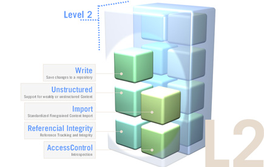

<!--
   Licensed to the Apache Software Foundation (ASF) under one or more
   contributor license agreements.  See the NOTICE file distributed with
   this work for additional information regarding copyright ownership.
   The ASF licenses this file to You under the Apache License, Version 2.0
   (the "License"); you may not use this file except in compliance with
   the License.  You may obtain a copy of the License at

       http://www.apache.org/licenses/LICENSE-2.0

   Unless required by applicable law or agreed to in writing, software
   distributed under the License is distributed on an "AS IS" BASIS,
   WITHOUT WARRANTIES OR CONDITIONS OF ANY KIND, either express or implied.
   See the License for the specific language governing permissions and
   limitations under the License.
-->

JCR API
=======
Jackrabbit is a complete, and fully compliant implementation of  the Content Repository API for Java Technology (JCR)
and therefore its primary API is defined by JCR. For a developer this means that most operations required are defined by
the JCR API. The classes and interfaces within Apache Jackrabbit are only needed when accessing functionality that is
not specified in JCR.

Beyond the JCR API Jackrabbit features numerous extensions and administrational features that are needed to run a
repository  but are not (yet) specified by JCR. (see [Jackrabbit Architecture](jackrabbit-architecture.html))

See the javadoc documentation of the JCR API and Apache Jackrabbit releases:

* [JCR 2.0](https://docs.adobe.com/docs/en/spec/javax.jcr/javadocs/jcr-2.0)
* [Apache Jackrabbit Trunk](http://jackrabbit.apache.org/api/trunk/)
* [Apache Jackrabbit 2.16](http://jackrabbit.apache.org/api/2.16/)
* [Apache Jackrabbit 2.14](http://jackrabbit.apache.org/api/2.14/)
* [Apache Jackrabbit 2.12](http://jackrabbit.apache.org/api/2.12/)
* [Apache Jackrabbit 2.10](http://jackrabbit.apache.org/api/2.10/)
* [Apache Jackrabbit 2.8](http://jackrabbit.apache.org/api/2.8/)

* [JCR 1.0](http://www.day.com/maven/jsr170/javadocs/jcr-1.0/)

JSR-170 Levels
--------------
The Content Repository API for Java Technology (JSR-170) is split into different Levels of compliancy, to allow
Repository Vendors to gradually adopt JSR-170 and to avoid that the overhead is unnecessarily high for repository
vendors that only want to expose portions of their repository functionality through a JSR-170 compliant Interface.

JSR-170 specifies a Level 1, a Level 2 and a set of advanced repository feature blocks. Jackrabbit is fully JSR-170
compliant and therefore supports Level 1, Level 2 and all the optional blocks.

### Level 1 : Ease of Adoption, Covering many usecases
The Scope of Level 1 of JSR-170 to cover a large number of simple  Applications, that need to search repositories and
need to read  from repositories. Level 1 specifies a read-only API that allows to  introspect Node and Property-types
and offers hierarchical read access to content stored in a repository.

Level 1 of JSR-170 is geared to allow people to write  applications such as search and display Portlets,
CMS-Templates, Reports, Exports or other applications  that harvest, search, present or display information  from one
or multiple repositories.

### Level 2 : Writeable Repository
Level 2 of JSR-170 specifies all the writing  capabilities need to bi-directionally interact with a content repository
in a fine and coarse grained  fashion.

Applications written against Level 2 of JSR-170 include management applications or generally speaking any  application
that generates data, information or content for both structured and unstructured information.

### Advanced Options
On top of Level 1 or Level 2 a number of functional  block serve for more advanced repository functionality. This
includes functions like: Versioning, (JTA) Transactions, Query using SQL, Explicit  Locking and Content Observation.

A fully JSR-170 compliant repository like Jackrabbit encompasses all the functionality and therefore lends itself as
general purpose, off-the-shelf  infrastructure for Content-, Document- and Source Code Management or for just about any
other application that persists content.