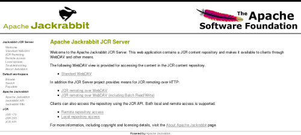

<!--
   Licensed to the Apache Software Foundation (ASF) under one or more
   contributor license agreements.  See the NOTICE file distributed with
   this work for additional information regarding copyright ownership.
   The ASF licenses this file to You under the Apache License, Version 2.0
   (the "License"); you may not use this file except in compliance with
   the License.  You may obtain a copy of the License at

       http://www.apache.org/licenses/LICENSE-2.0

   Unless required by applicable law or agreed to in writing, software
   distributed under the License is distributed on an "AS IS" BASIS,
   WITHOUT WARRANTIES OR CONDITIONS OF ANY KIND, either express or implied.
   See the License for the specific language governing permissions and
   limitations under the License.
-->

Standalone Server
=================
Each Jackrabbit release comes with a pre-built and runnable standalone server jar. It's the easiest way to get started 
with Jackrabbit, simply [download](downloads.html) and start the jar to get a fully functional JCR content repository.
The rest of this page documents what else you can do with the standalone server.

Running the standalone server
-----------------------------
You need Java version 5 or higher to run the Jackrabbit standalone server.
To start the server, double-click on the standalone jar file, or invoke it
on the command line.

    $ java -jar jackrabbit-standalone-1.6.0.jar
    Welcome to Apache Jackrabbit!
    -------------------------------
    Using repository directory jackrabbit
    Writing log messages to jackrabbit/log
    Starting the server...
    Apache Jackrabbit is now running at http://localhost:8080/
    ^C
    Shutting down the server...
    -------------------------------
    Goodbye from Apache Jackrabbit!

After staring the server, you can point your browser to http://localhost:8080/ 
to see Jackrabbit in action. Use the `--port` command line option to specify an 
alternative if the default port 8080 is already used by another program.

This is what the server should look like in your browser:

By default the server will look for a content repository in the
`./jackrabbit` directory and a repository configuration file in a
`repository.xml` file within the repository directory. The repository
directory is automatically created if it does not already exist, and a
configuration file with the default configuration is created if no
configuration is found.

Server, access, and repository log messages are written to log files in the `log` 
subdirectory within the repository directory.

You can stop the server by pressing `Ctrl-C` or by sending it a standard
termination signal. The server will then close the content repository and
exit cleanly.

Command line options
--------------------
You can customize the operation of the standalone server with the following
command line options (with defaults in parenthesis).

    $ java -jar jackrabbit-standalone-1.6.0.jar --help
    usage: java -jar jackrabbit-standalone-1.6.0.jar [-?][-b][-c <arg>][-C <arg>]
           [-d][-f <arg>][-h <arg>][-l][-n][-p <arg>][-q][-r <arg>][-R <arg>]
    
    options:
     -?,--help              print this message
     -b,--backup            create a backup of the repository
     -c,--conf <arg>        repository configuration file
     -C,--backup-conf <arg> backup repository configuration file
     -d,--debug             enable debug logging
     -f,--file <arg>        location of this jar file
     -h,--host <arg>        IP address of the HTTP server
     -l,--license           print license information
     -n,--notice            print copyright notices
     -p,--port <arg>        TCP port of the HTTP server (8080)
     -q,--quiet             disable console output
     -r,--repo <arg>        repository directory (jackrabbit)
     -R,--backup-repo <arg> backup repository directory (jackrabbit-backupN)

You may want to increase the maximum amount of heap memory available to the
Java virtual machine especially if you plan to have lots of concurrent
clients accessing the repository or want to perform large batch operations.

    $ java -Xmx256m -jar jackrabbit-standalone-1.6.0.jar

Web interface
-------------
The web interface you see at http://localhost:8080/
is a simple web application built on top of the content repository. It
contains some basic instructions on how to access the repository and comes
with the following utility tools:

* Populate http://localhost:8080/populate.jsp  
    This tool populates the default workspace with example documents found on
    the web based on a Google search. This is an easy way to get some
    semi-random test content into the repository.

* Search http://localhost:8080/search.jsp  
    This tool uses the full text search feature to find content within the
    default workspace of the repository. To see the search feature in action,
    first add some content to the repository with the Populate tool and then
    try to search for the documents with the Search tool.

* Browse http://localhost:8080/repository/default/  
    The built-in WebDAV feature allows you to browse the file (`nt:file`)
    and folder (`nt:folder`) nodes within the repository. See the WebDAV
    section below for all the other things you can do with this tool! Note that
    the server will by default accept any username and password combination.

WebDAV access
-------------
The simple repository browser you can see at http://localhost:8080/repository/default/
is actually a fully featured WebDAV server backed by the content
repository. You can mount this address as a WebDAV share to your normal
filesystem and treat it as you would any shared network folder. This
feature is especially useful for copying large amounts of files or folders
to or from the repository. Note that this feature is limited to standard
files and folders, any more fine-grained JCR content will simply not be
visible.

The repository also exposes an alternative WebDAV access point at http://localhost:8080/server/
for more fine-grained content access. This access point implements a
number of advanced WebDAV features that are not normally seen in plain
file-based WebDAV servers. You will need a feature-rich WebDAV or HTTP
client to access the full power of this interface. With the Jackrabbit
spi2dav component you can even get full remote JCR access over the WebDAV
features and some custom extensions available through this access point.

RMI access
----------
In addition to the WebDAV access points, the standalone server also
supports remote JCR access over RMI. After adding the JCR API and the
jackrabbit-jcr-rmi jars to your classpath, you can access the repository
remotely with the following code:

    import org.apache.jackrabbit.rmi.repository.URLRemoteRepository;

    Repository repository = new URLRemoteRepository("http://localhost:8080/rmi");

Backup and migration
--------------------
You can also use the standalone server jar to backup existing repositories
or to migrate them to a different configuration. The backup mode is
activated with the `--backup` command line option. The essential command
line options and their default values for the backup mode are:
    
    $ java -jar jackrabbit-standalone-1.6.0.jar --backup \
           --repo=jackrabbit \
           --conf=jackrabbit/repository.xml \
           --backup-repo=jackrabbit-backupN \
           --backup-conf=jackrabbit-backupN/repository.xml

Note that the source repository must not be running when you use this
feature. If the target repository already exist, then all content inside it
is overwritten. Note also that the search indexes of the target repository
will be generated only when the repository is next started. This keeps the
disk size of the backup smaller, but causes a notable startup delay
especially for large repositories if you need to restore that backup.

To migrate a repository to a different configuration, simply point the
`--backup-conf` option to a custom repository configuration file. Note
that by default the backups are made using the default Jackrabbit
repository configuration, regardless of the configuration of the source
repository.

Drawbacks
---------
The Jackrabbit Standalone server is designed primarily as a quick and easy
way to get a content repository up and running for testing and development
purposes. For more complex deployment scenarios and configuration options
you should look at the [Jackrabbit Web Application](jackrabbit-web-application.html)
and [Jackrabbit JCA Resource Adapter](jackrabbit-jca-resource-adapter.html)
packages.

Note also that RMI remoting layer has not been optimized for performance,
so currently the recommendation for accessing the JCR API in performance
critical applications is to have the repository running locally in the same
process as the client application.
